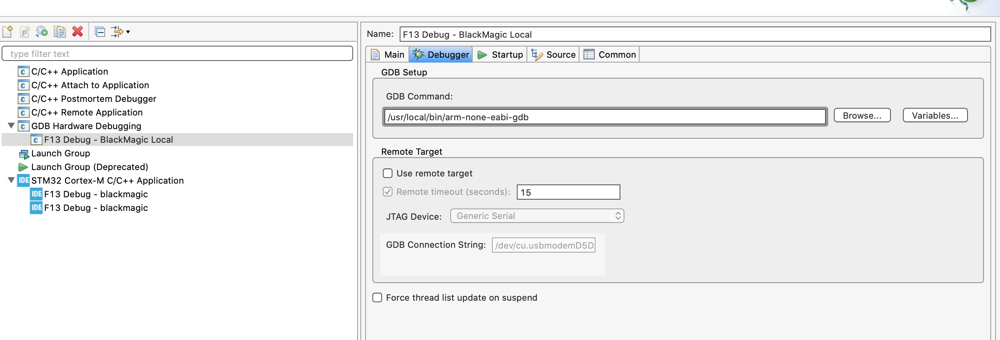
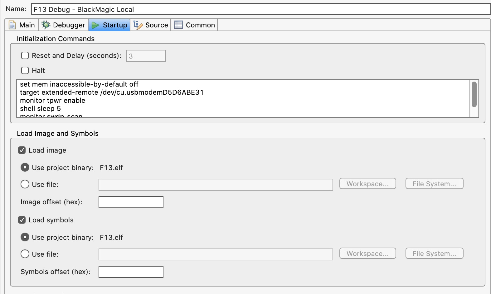

# BlackMagic-STM32CubeIDE
How to set up a blackmagic probe with STM32CubeIDE

* First, you add a "GDB Hardware Debugging"
* Second, fill out the command page like this:

* Third, set up the page like the screenshot below, replacing cu.usbmodem as needed.

On OSX, find your device, it will be the FIRST of two /dev/cu.usbmodemXXXXXXXXX devices. The second device is the UART. Replace the cu.usbmodem device below with the one you found.

The complete startup script is:

     set mem inaccessible-by-default off
     target extended-remote /dev/cu.usbmodemD5D6ABE31
     monitor tpwr enable
     shell sleep 5
     monitor swdp_scan
     attach 1

What it does:

     set mem inaccessible-by-default off -- Don't allow access to memory mapped IO
     target extended-remote /dev/cu.usbmodemD5D6ABE31  -- Points to the correct serial device.
     monitor tpwr enable  -- by default, target power is disabled, this enables it
     shell sleep 5        -- it takes some time for the device to power up.  This allows 5 seconds which should be more than enough.
     monitor swdp_scan    -- scan for devices, using swdp mode
     attach 1             -- attach to the first (this should be the part you are debugging if using a BluePill, you may need to change if you're doing something fancier)

# IMPORTANT - TO START DEBUGGING SESSION
To start the debugging session of a arm binary, you must select "Run" -> "Debug Configurations....", select the configuraton you just created, then use the "Debug" button on that page.
